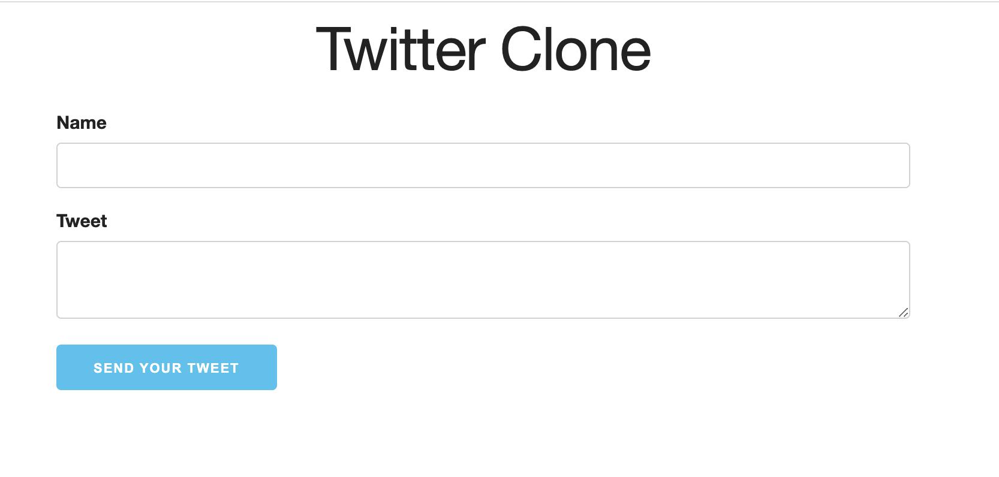

# LittleTwitterClone
Club Learning Activity in Building WebApp \
LittleTwitterClone is a simple, lightweight Twitter-like application built using Node.js, JavaScript, HTML, and MongoDB. Users can send tweets, which will be displayed in a reverse-chronological order, showing the latest tweets at the top.

## Features

- Post new tweets
- View tweets in a reverse-chronological order
- Responsive design for both desktop and mobile devices

## Getting Started

### Prerequisites

- Node.js
- MongoDB

### Installation

1. Clone the repository: git clone https://github.com/Vin3ntKing/LittleTwitterClone.git

2. Navigate to the project directory

3. Install the required dependencies

4. Start the MongoDB server

5. In another terminal window, start the Node.js server

6. Open your browser and navigate to `http://localhost:3000` to start using LittleTwitterClone.

## Technologies Used

- Node.js
- JavaScript
- HTML
- CSS
- MongoDB

## License

This project is licensed under the MIT License. See the [LICENSE](LICENSE) file for details.
